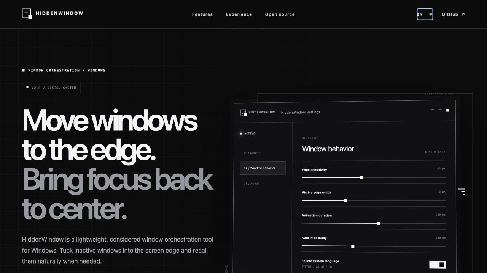

<p align="center">
  
</p>

<h1 align="center">HiddenWindow</h1>

<p align="center"><strong>A refined open-source window orchestration layer for Windows.</strong></p>

<p align="center">
  Move inactive windows to the screen edge. Recall them naturally. Keep your attention at the center.
</p>

<p align="center">
  <a href="https://github.maziyang.top"><strong>Product website</strong></a>
  · <a href="https://github.com/Maziyang2/HiddenWindow/releases/latest">Latest release</a>
  · <a href="./README_zh.md">中文说明</a>
</p>


## A third place for your windows

Closing a window loses context. Minimizing it means finding it again. HiddenWindow introduces a third option: keep the window where you remember it, without keeping it in your current field of view.

Drag a window to the top, bottom, left, or right edge of any display. HiddenWindow moves it just beyond the screen, leaving a precise visible edge. Approach that edge to reveal the window; move away and it quietly retreats.

## What makes it useful

- Dock and hide on all four screen edges
- Recall windows by approaching their corresponding edge
- Match the pointer to the correct hidden window when several share one edge
- Work naturally across multi-monitor layouts
- Ignore maximized and fullscreen windows
- Pause or resume docking globally with `Ctrl + Alt + H`
- Tune edge sensitivity, visible width, animation timing, and hide delay
- Launch with Windows and check for updates automatically
- Run as a portable, single-file application

## v2.0 design system

HiddenWindow v2.0 gives the application, website, icon, and documentation one coherent visual language:

- a restrained black, white, and gray palette;
- crisp geometry and strong screen-edge lines;
- subtle glass depth without decorative noise;
- a new brand mark that shows a window moving beyond the display boundary;
- a completely redesigned Settings and About experience;
- automatic interface localization based on the Windows display language;
- manual language selection: **Follow system**, **简体中文**, or **English**.

The window-docking engine remains intentionally focused. The redesign changes how HiddenWindow communicates and feels without turning a small utility into a complicated workspace product.

## Interface preview

### Chinese-first website


### Complete English presentation



The website and application share the same Edge Window mark, typography hierarchy, monochrome palette, control geometry, and product language. The simulated interface above mirrors the v2.0 Windows Settings design; native Windows screenshots can be added in a later documentation update.

## Language behavior

HiddenWindow uses the Windows UI culture on first launch:

- Simplified Chinese Windows → 简体中文
- Other display languages → English
- Manual override → Follow system / 简体中文 / English

The choice is stored locally in `%AppData%\HiddenWindow\settings.json`. No language or usage data is transmitted.

## Usage

1. Download `HiddenWindow.exe` from [Releases](https://github.com/Maziyang2/HiddenWindow/releases/latest).
2. Run it; no installer is required.
3. Right-click the tray icon and open **Settings**.
4. Drag any eligible window to a screen edge.
5. Move the pointer to that edge to recall the window.
6. Press `Ctrl + Alt + H` to pause or resume docking.

## Project structure

```text
src/HiddenWindow/
├── MainForm.cs          Tray lifecycle, menu, hotkey, updates
├── DockManager.cs       Docking, reveal, hide, and animation engine
├── SettingsForm.cs      v2.0 settings interface
├── AboutForm.cs         v2.0 product and website presentation
├── Localization.cs      Simplified Chinese and English resources
├── UiControls.cs        Shared monochrome controls and brand mark
├── EdgeHintForm.cs      Window-title hint shown at the screen edge
├── Settings.cs          Local configuration model and persistence
├── WinApi.cs            Win32 and DWM interop
└── Assets/              Windows application icon
```

## Build from source

Requires the .NET 8 SDK on Windows, or a recent .NET SDK with Windows targeting enabled.

```powershell
dotnet build .\src\HiddenWindow\HiddenWindow.csproj -c Release
```

Portable single-file build:

```powershell
dotnet publish .\src\HiddenWindow\HiddenWindow.csproj -c Release -r win-x64 --self-contained true -p:PublishSingleFile=true -p:IncludeNativeLibrariesForSelfExtract=true
```

Output:

```text
src/HiddenWindow/bin/Release/net8.0-windows/win-x64/publish/HiddenWindow.exe
```

## 中文说明

HiddenWindow 是一款轻量、克制的 Windows 窗口编排工具。把暂时不用的窗口拖到屏幕边缘，它会自动收进屏幕外；鼠标靠近对应边缘时，窗口自然滑回，离开后再次隐藏。

v2.0 统一升级了软件、官网、图标和文档的视觉系统，并新增完整中英文界面。软件默认跟随 Windows 显示语言，也可以在设置中手动选择“跟随系统 / 简体中文 / English”。完整中文文档请阅读 [README_zh.md](./README_zh.md)。

## Status

HiddenWindow v2.0.0 is the current stable release. Download the portable, self-contained `HiddenWindow.exe` from the [latest release](https://github.com/Maziyang2/HiddenWindow/releases/latest); no installer or separate .NET runtime is required.

## License

HiddenWindow is released under the [MIT License](./LICENSE).

Designed for focus. Built by [Maziyang2](https://github.com/Maziyang2).
