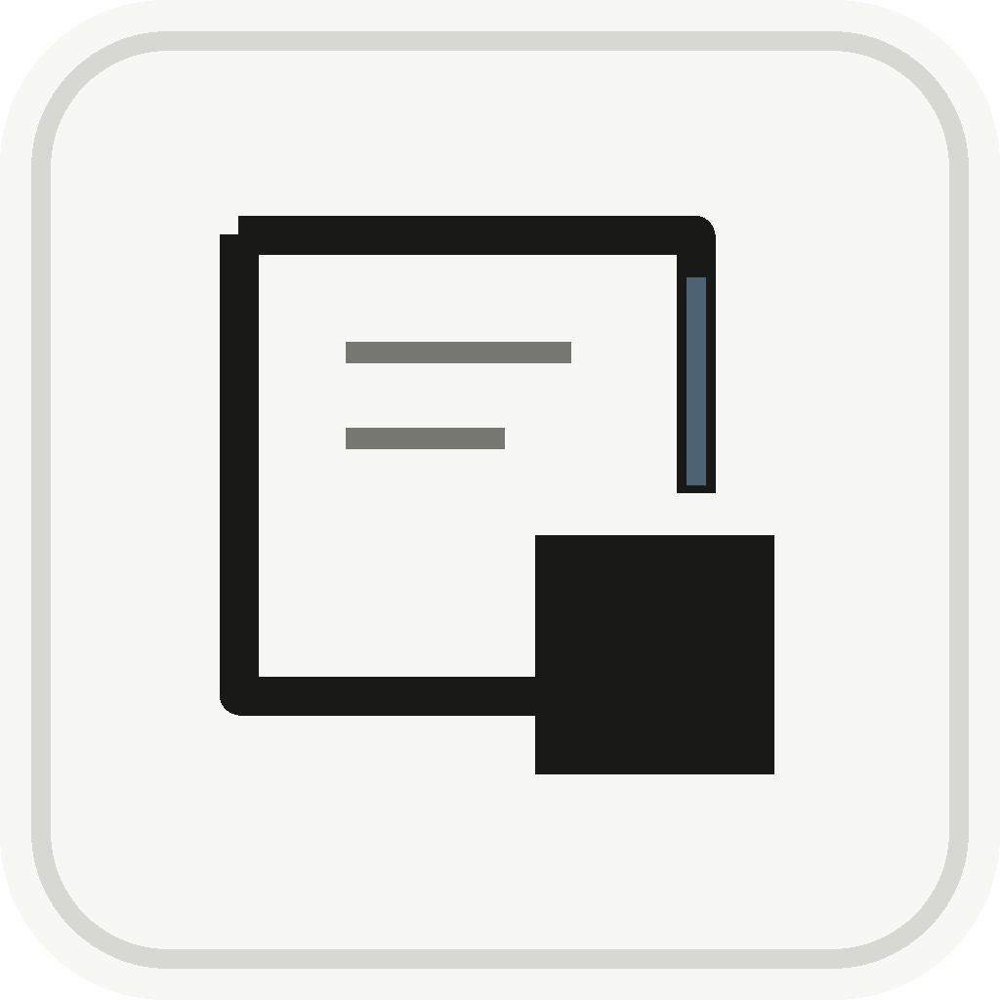
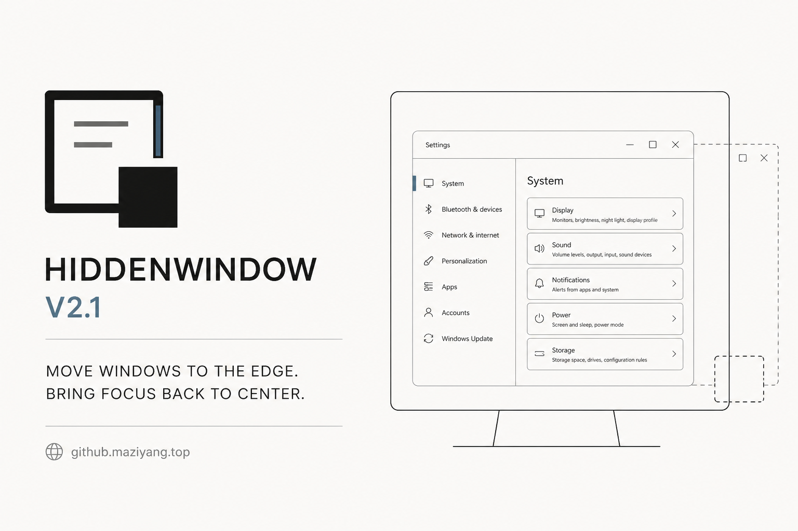

<p align="center">
  
</p>

<h1 align="center">HiddenWindow</h1>

<p align="center"><strong>A refined open-source window orchestration layer for Windows.</strong></p>

<p align="center">
  Move inactive windows to the screen edge. Recall them naturally. Keep your attention at the center.
</p>

<p align="center">
  <a href="https://github.maziyang.top"><strong>Product website</strong></a>
  · <a href="https://github.com/Maziyang2/HiddenWindow/releases/latest">Latest release</a>
  · <a href="./README_zh.md">中文说明</a>
</p>



## A third place for your windows

Closing a window loses context. Minimizing it means finding it again. HiddenWindow introduces a third option: keep the window where you remember it, without keeping it in your current field of view.

Drag a window to the top, bottom, left, or right edge of any display. HiddenWindow moves it just beyond the screen, leaving a precise visible edge. Approach that edge to reveal the window; move away and it quietly retreats.

## What makes it useful

- Dock and hide on all four screen edges
- Recall windows by approaching their corresponding edge
- Match the pointer to the correct hidden window when several share one edge
- Work naturally across multi-monitor layouts
- Ignore maximized and fullscreen windows
- Pause or resume docking globally with `Ctrl + Alt + H`
- Tune edge sensitivity, visible width, animation timing, and hide delay
- Launch with Windows and check for updates automatically
- Run as a portable, single-file application

## v2.1 Minimalism system

HiddenWindow v2.1 gives the application, website, browser tab icon, and documentation one coherent visual language:

- a warm white canvas, near-black typography, and a stable gray scale;
- grid, baseline, spacing, and type hierarchy instead of decorative surfaces;
- thin, consistent lines with one restrained blue-gray focus color;
- a lighter brand mark that shows a window moving beyond the display boundary;
- a completely redesigned Settings and About experience;
- automatic interface localization based on the Windows display language;
- manual language selection: **Follow system**, **简体中文**, or **English**.

The window-docking engine remains intentionally focused. The redesign changes how HiddenWindow communicates and feels without turning a small utility into a complicated workspace product.

## Interface preview

The [Chinese-first product website](https://github.maziyang.top) includes a complete English presentation. The website and application share the same Edge Window mark, light canvas, typography hierarchy, control geometry, and product language.

## Minimalism design prompt archive

The following Chinese prompt is the shared v2.1 design brief. Keep its intent when evolving the Windows app, website, icon, or documentation.

> **角色设定：** 你是一名偏爱「少即是多」的极简主义 UI 设计师，需要为产品团队说明 Minimalism 家族的视觉原则和适用场景，避免大家误把「简单」理解成「随便」或「什么都删掉」。
>
> **场景定位：** 极简家族适合信息结构清晰、内容质量高、品牌气质偏理性或高端的产品，例如文档工具、写作平台、作品集网站、高端品牌落地页和数据故事页面。它特别适合需要长时间阅读或思考的场景，让用户在没有视觉噪音干扰的情况下专注于内容本身。
>
> **视觉设计理念：** 极简主义不是「空白越多越好」，而是通过有意识地删减装饰，把视觉注意力集中在核心元素上。界面以黑白灰为主，辅以极少数强调色；结构上依靠网格、基线和明确的层级关系组织信息，而不是靠边框、阴影和复杂背景。标题、正文和辅助信息在排版上有清晰的节奏，让用户能一眼看出「哪里最重要」「哪里是说明」「哪里是补充」。
>
> **材质与质感：** 在 Minimalism 家族中，材质被压缩到几乎看不见——没有明显的纹理和渐变，阴影如果存在也非常轻微。页面主要由干净的白色背景、细线分隔和少量浅灰区块构成，辅以清晰的黑色文字。所有元素的边框、线条和图标都保持细而稳定的线宽，避免粗重轮廓打破整体的轻盈感。页面的「质感」来自版面秩序和留白，而不是来自表面的华丽效果。
>
> **交互体验：** 交互反馈在极简风格中是克制而明确的。按钮悬停后可能只改变边框颜色、文字颜色或透明度，而不会出现大幅缩放、阴影爆发或炫目渐变。链接在 hover 时出现简单下划线即可；卡片在交互时可以轻微调整背景色或边框颜色，但仍然保持「安静」。动画节奏通常偏慢且流畅，避免频繁闪烁，让长时间阅读不被打扰。
>
> **整体氛围：** Minimalism 家族营造的是一种安静、清晰、带有思考空间的界面气质。用户进入页面时不会被视觉效果轰炸，而是感受到宽阔的留白、整齐的文字和少量有力的视觉焦点。它非常适合作为内容或品牌的「画廊空间」，让真正重要的文字、图像和数据成为舞台主角。

## Language behavior

HiddenWindow uses the Windows UI culture on first launch:

- Simplified Chinese Windows → 简体中文
- Other display languages → English
- Manual override → Follow system / 简体中文 / English

The choice is stored locally in `%AppData%\HiddenWindow\settings.json`. No language or usage data is transmitted.

## Usage

1. Download `HiddenWindow.exe` from [Releases](https://github.com/Maziyang2/HiddenWindow/releases/latest).
2. Run it; no installer is required.
3. Right-click the tray icon and open **Settings**.
4. Drag any eligible window to a screen edge.
5. Move the pointer to that edge to recall the window.
6. Press `Ctrl + Alt + H` to pause or resume docking.

## Project structure

```text
src/HiddenWindow/
├── MainForm.cs          Tray lifecycle, menu, hotkey, updates
├── DockManager.cs       Docking, reveal, hide, and animation engine
├── SettingsForm.cs      v2.1 settings interface
├── AboutForm.cs         v2.1 product and website presentation
├── Localization.cs      Simplified Chinese and English resources
├── UiControls.cs        Shared monochrome controls and brand mark
├── EdgeHintForm.cs      Window-title hint shown at the screen edge
├── Settings.cs          Local configuration model and persistence
├── WinApi.cs            Win32 and DWM interop
└── Assets/              Windows application icon
scripts/
└── generate_brand_assets.py  Reproducible PNG and ICO generation
```

## Build from source

Requires the .NET 8 SDK on Windows, or a recent .NET SDK with Windows targeting enabled.

```powershell
dotnet build .\src\HiddenWindow\HiddenWindow.csproj -c Release
```

Portable single-file build:

```powershell
dotnet publish .\src\HiddenWindow\HiddenWindow.csproj -c Release -r win-x64 --self-contained true -p:PublishSingleFile=true -p:IncludeNativeLibrariesForSelfExtract=true
```

Output:

```text
src/HiddenWindow/bin/Release/net8.0-windows/win-x64/publish/HiddenWindow.exe
```

## 中文说明

HiddenWindow 是一款轻量、克制的 Windows 窗口编排工具。把暂时不用的窗口拖到屏幕边缘，它会自动收进屏幕外；鼠标靠近对应边缘时，窗口自然滑回，离开后再次隐藏。

v2.1 以极简主义重新统一软件、官网、浏览器图标和文档：亮色纸面、黑白灰秩序、细线与极少量强调色。软件默认跟随 Windows 显示语言，也可以在设置中手动选择“跟随系统 / 简体中文 / English”。完整中文文档请阅读 [README_zh.md](./README_zh.md)。

## Status

HiddenWindow v2.1.0 is the current stable release. Download the portable, self-contained `HiddenWindow.exe` from the [latest release](https://github.com/Maziyang2/HiddenWindow/releases/latest); no installer or separate .NET runtime is required.

## License

HiddenWindow is released under the [MIT License](./LICENSE).

Designed for focus. Built by [Maziyang2](https://github.com/Maziyang2).
