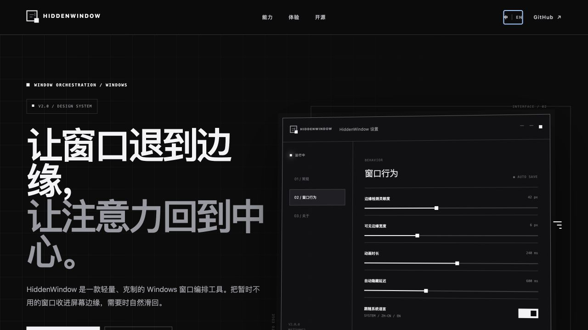

# HiddenWindow v2.0

[English README](./README.md) · [产品主页](https://github.maziyang.top) · [最新版本](https://github.com/Maziyang2/HiddenWindow/releases/latest)

HiddenWindow 是一款为 Windows 打造的开源窗口编排工具：把暂时不用的窗口收进屏幕边缘，需要时自然唤回，让桌面保持安静、清晰和专注。


## 为什么需要 HiddenWindow

关闭窗口会丢失上下文，最小化又需要重新寻找。HiddenWindow 提供第三种选择：窗口仍然待在你记得的位置，却不再占用当前视野。

把窗口拖到任意显示器的上、下、左或右边缘，它会自动收进屏幕外，只留下一条清晰可感知的边界。鼠标靠近对应边缘时，窗口顺滑出现；移开后，它安静退场。

## 核心能力

- 支持屏幕四边吸附与隐藏
- 鼠标靠近对应边缘即可唤回窗口
- 同一边缘存在多个窗口时，根据光标所在范围准确唤回
- 支持多显示器布局
- 自动忽略最大化和全屏窗口
- `Ctrl + Alt + H` 全局暂停或恢复吸附
- 可调整边缘灵敏度、可见宽度、动画时长和隐藏延迟
- 支持开机自启、后台更新检查和单文件运行

## v2.0 视觉与语言升级

- 软件、官网、图标与文档使用统一的黑白灰设计系统
- 新图标表达“窗口穿过屏幕边缘”的核心功能
- 设置窗口、托盘菜单、关于页和边缘提示全面现代化
- 界面边界更加清晰、硬朗，只使用少量毛玻璃层次
- 默认根据 Windows 显示语言自动切换简体中文或 English
- 支持手动选择“跟随系统 / 简体中文 / English”



## 使用方式

1. 从 [Releases](https://github.com/Maziyang2/HiddenWindow/releases/latest) 下载 `HiddenWindow.exe`。
2. 直接运行，无需安装。
3. 右键托盘图标进入“设置”。
4. 把普通窗口拖到任意屏幕边缘。
5. 鼠标靠近对应边缘即可唤回。
6. 按 `Ctrl + Alt + H` 暂停或恢复吸附。

设置保存在 `%AppData%\HiddenWindow\settings.json`，语言与使用数据不会上传。

## 从源码构建

需要 .NET 8 SDK：

```powershell
dotnet build .\src\HiddenWindow\HiddenWindow.csproj -c Release
```

发布单文件版本：

```powershell
dotnet publish .\src\HiddenWindow\HiddenWindow.csproj -c Release -r win-x64 --self-contained true -p:PublishSingleFile=true -p:IncludeNativeLibrariesForSelfExtract=true
```

## 当前状态

HiddenWindow v2.0.0 现已作为正式稳定版发布。请从[最新版本](https://github.com/Maziyang2/HiddenWindow/releases/latest)下载便携、自包含的 `HiddenWindow.exe`；无需安装，也无需单独配置 .NET 运行时。

## 许可证

HiddenWindow 使用 [MIT License](./LICENSE) 开源。

为专注而设计。由 [Maziyang2](https://github.com/Maziyang2) 构建。
